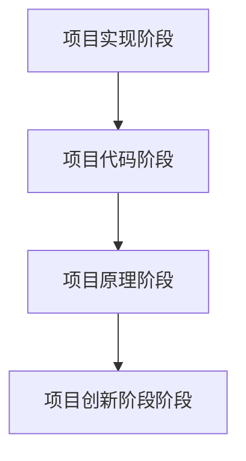

从零开始一个AI项目
=
# AI-program-from-zero 
I want to help newcomers who are looking to get into AI or related fields to build an AI model and algorithm from zero to completion.
很多新人开始人工智能项目，都是从~先学好 Python 基础语法；然后，因为听说数据科学三件套是 NumPy, Pandas, Matplotlib，所以要花大量时间去啃这些库的API；等这些都掌握了，再开始看 PyTorch 的官方文档；最后，当你觉得所有基础零件都准备好了，才敢去找一个项目来动手~，这样从开始到结束需要花费大量时间，甚至会半途而废。因此，我想到**以项目为驱动，进行即时学习，先让程序跑起来，亲眼看到结果，获得即时正反馈，并且利用大语言模型进行辅助学习**。  
一般分为几个阶段，本项目将聚焦于适合第一阶段的项目：  

开始所有的基于Python的AI项目都要预先安装以下几个软件或者Python库(注意不要安装太新的版本,最好是使用Linux系统，笔记本电脑用Windows也可)；  
1.[Anaconda](https://mirrors.tuna.tsinghua.edu.cn/anaconda/archive/)(主要用于Python环境管理，当项目多了之后，需要用到各种不同版本的库，容易造成冲突)  
2.[CUDA](https://developer.nvidia.com/cuda-toolkit-archive)(这是N卡的并行计算平台和编程模型)，[cuDNN](https://developer.nvidia.com/rdp/cudnn-archive)(一个 GPU 加速的深度神经网络基本操作库)  
3.[pytorch](https://pytorch.org/)(用于构建深度学习模型的功能完备框架，是一种通常用于图像识别和语言处理等应用程序的机器学习)一定要选择GPU版本，并且和你的CUDA和Python匹配  
4.Python IDE,这个请自由选择，不做要求  
5.网络上有许多Python IDE（PyCharm）+Anaconda+CUDA+pytorch的安装教程，请选择一个详细的教程学习，这会花上几天时间
# [1.从零开始本地配置目标检测](https://github.com/PYuzhang/AI-program-from-zero/tree/main/目标检测)
