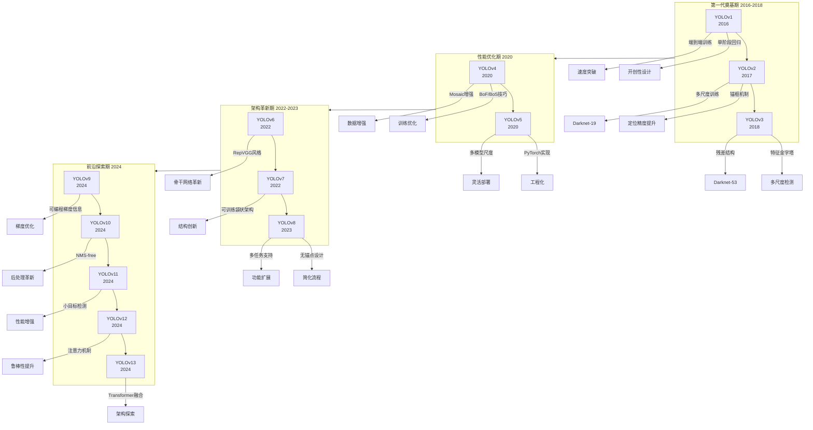

快速实现目标检测
=
# 1.目标检测任务
目标检测是计算机视觉中的核心任务，旨在识别和定位图像或视频中的特定物体。它不仅需要判断图像中存在哪些类别的物体（分类任务），还需要通过边界框精确标出每个物体的位置（定位任务）。目标检测技术广泛应用于自动驾驶、视频监控、医疗影像分析和机器人导航等领域，是实现机器“视觉理解”的关键一步。  
YOLO是其中的佼佼者，检测速度和精度都是非常好的，并且实现较为简单。  
# 2.YOLO算法发展历史 (v1-v13)


# 3.快速实现YOLOv13算法
在基于前面所说的Python相关软件和库安装完成后，我们选择用pip进行安装(以下都可以在PyCharm中运行)  
```
pip install ultralytics
```  
创建一个Python文件,代码如下    
```from ultralytics import YOLO
# Load a pretrained YOLO11n model，如果下载太慢可以点击这个链接下载，并用自己下载的yolo11n.pt所在的文件地址替换，例如“D:\2-Python\1-YOLO\YOLOv11\ultralytics-8.3.2\yolo11n.pt”
model = YOLO("yolo11n.pt")
# Run inference on 'bus.jpg' with arguments,可以将其中图片替换成自己的，需要修改链接
model.predict("https://ultralytics.com/images/bus.jpg", save=True, imgsz=320, conf=0.5, show=True)
```
  
最后结果：  

